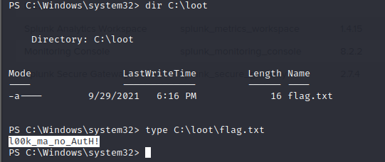

# Splunk - Discovery & Enumeration

## Intro

* Splunk is often used for security monitoring and business analytics
* Splunk deployments are often used to house sensitive data and could provide a wealth of information for an attacker if compromised
* Splunk has not suffered from many known vulnerabilities
  * CVE-2018-11409 -> information disclosure vulnerability
  * CVE-2011-4642 -> remote code execution
* Splunk does not suffer from many exploitable vulnerabilities and is quick to patch any issues
* <mark style="color:red;">**Focus on weak or null authentication**</mark>

### Discovery/Footprinting

* Splunk often runs as root on Linux or SYSTEM on Windows systems
* The Splunk web server runs by default on port 8000
* On older versions of Splunk, the default credentials are `admin:changeme`
  * displayed on the login&#x20;


* The latest version of Splunk sets credentials during the installation process
* check for common weak passwords such as `admin`, `Welcome`, `Welcome1`, `Password123`


### **Discover Splunk with Nmap service scan**

```shell-session
sudo nmap -sV 10.129.201.50

Starting Nmap 7.80 ( https://nmap.org ) at 2021-09-22 08:43 EDT
Nmap scan report for 10.129.201.50
Host is up (0.11s latency).
Not shown: 991 closed ports
PORT     STATE SERVICE       VERSION
80/tcp   open  http          Microsoft IIS httpd 10.0
135/tcp  open  msrpc         Microsoft Windows RPC
139/tcp  open  netbios-ssn   Microsoft Windows netbios-ssn
445/tcp  open  microsoft-ds?
3389/tcp open  ms-wbt-server Microsoft Terminal Services
5357/tcp open  http          Microsoft HTTPAPI httpd 2.0 (SSDP/UPnP)
8000/tcp open  ssl/http      Splunkd httpd
8080/tcp open  http          Indy httpd 17.3.33.2830 (Paessler PRTG bandwidth monitor)
8089/tcp open  ssl/http      Splunkd httpd
Service Info: OS: Windows; CPE: cpe:/o:microsoft:windows

Service detection performed. Please report any incorrect results at https://nmap.org/submit/ .
Nmap done: 1 IP address (1 host up) scanned in 39.22 seconds
```

### Enumeration

* Enterprise trial converts to a free version after 60 days, which doesn’t require authentication
* This will automatically convert to the free version that does not have any form of authentication
* Some organizations may opt for the free version due to budget constraints


Once logged in to Splunk, we can **browse data**, **run reports**, **create dashboards**, **install applications from the Splunkbase library**, and **install custom applications**.

<figure><figcaption></figcaption></figure>

* Splunk has multiple ways of running code, such as server-side Django applications, REST endpoints, scripted inputs, and alerting scripts
* scripted input -> common method of gaining remote code execution
  * designed to help integrate Splunk with data sources such as APIs or file servers that require custom methods to access
  * Scripted inputs are intended to run these scripts, with STDOUT provided as input to Splunk
  * scripted inputs can be created to run **Bash**, **PowerShell**, or **Batch scripts**
* every Splunk installation comes with Python installed
* Python scripts can be run on any Splunk system

## Assessment

Enumerate the Splunk instance as an unauthenticated user. Submit the version number to move on (format 1.2.3).

<figure><figcaption><p>8000</p></figcaption></figure>

Access using HTTPS 10.129.201.50:8000

<figure><figcaption><p>8.2.2</p></figcaption></figure>
