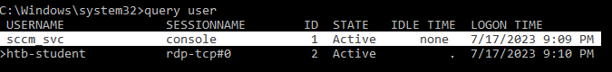

# Assessment

## Easy

> for this one i forgot to get a screen shot but the steps where straight forward.

1. there are 2 ports open (SSH and FTP).
2. Use hydra to brute force the username and password at FTP.
   1. The password will be '7777777' and the username is something that starts with m\*\*\*
3. Use the credential to login into FTP and there will be SSH keys.
4. Use the key to SSH into the system. (along with the password/passphrase)
5. View the history to get the root password.

## Medium

<figure><figcaption><p>There are 2 service running SSH and SMB</p></figcaption></figure>

Check SMB for available shares and privilege.

<figure><figcaption><p>SHAREDRIVE is available</p></figcaption></figure>

Connect to share and get the file.

<figure><figcaption><p>Docs.zip</p></figcaption></figure>

The zip requires password.

<figure><figcaption></figcaption></figure>

The normal password.list didn't work but mut\_password.list worked.

<figure><figcaption><p>Destiny2022!</p></figcaption></figure>

<figure><figcaption><p>Documentation.docx</p></figcaption></figure>

<figure><figcaption></figcaption></figure>

<figure><figcaption></figcaption></figure>

We can see there is no database password set and the username is root.

<figure><figcaption><p>jason:C4mNKjAtL2dydsYa6</p></figcaption></figure>

<figure><figcaption></figcaption></figure>

<figure><figcaption><p>dennis:7AUgWWQEiMPdqx</p></figcaption></figure>

* Switched user to dennis
* look at the history

```shell-session
dennis@skills-medium:~$ history
    1  ssh-keygen -m PEM -t rsa
    2  ls
    3  cd
    4  cd ..
    5  cd
    6  cd .ssh/
    7  ls
    8  cat id_rsa.pub > authorized_keys
    9  vim authorized_keys 
   10  passwd
```

seems like something was done with the id\_rsa file.

* I downloaded the id\_rsa file
* ssh2john
* cracked the hash
*   And got the passphrase which doesn't use the same passphrase as dennis (might be root).

    <figure><figcaption><p>P@ssw0rd12020!</p></figcaption></figure>


* Then SSH to the system using the id\_rsa file along with the passphrase
* got the flag `HTB{PeopleReuse_PWsEverywhere!}`

## Hard

list of open ports

```
Open 10.129.82.61:111
Open 10.129.82.61:135
Open 10.129.82.61:139
Open 10.129.82.61:445
Open 10.129.82.61:2049
Open 10.129.82.61:3389
Open 10.129.82.61:5985
Open 10.129.82.61:47001
Open 10.129.82.61:49664
Open 10.129.82.61:49666
Open 10.129.82.61:49665
Open 10.129.82.61:49668
Open 10.129.82.61:49667
Open 10.129.82.61:49679
Open 10.129.82.61:49680
Open 10.129.82.61:49681
```

<figure><figcaption><p>johanna:1231234!</p></figcaption></figure>

<figure><figcaption></figcaption></figure>

<figure><figcaption><p>Download Logins.kdbx and crack it</p></figcaption></figure>

<figure><figcaption><p>Qwerty7!</p></figcaption></figure>

<figure><figcaption><p>david:gRzX7YbeTcDG7</p></figcaption></figure>

<figure><figcaption><p>get vhd file</p></figcaption></figure>

pass to bitlocker2john and then crack the hash

```
bitlocker$0$16$60d83def3e335699830cc42793dae6e5$1048576$12$80b2<SNIP>:123456789!
```

we got the password **123456789!**


<figure><figcaption></figcaption></figure>

<figure><figcaption><p>using pth and winrm to get the flag.</p></figcaption></figure>
