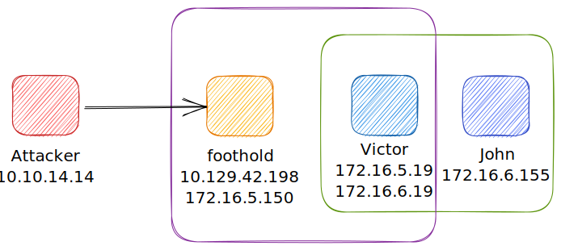

# Double Pivots - SocksOverRDP (Tunneling)

**Windows -> Windows**

DVC is responsible for tunneling packets over the RDP connection. This feature can be used to tunnel arbitrary packets over the network

We can use `SocksOverRDP` to tunnel our custom packets and then proxy through it. We will use the tool [Proxifier](https://www.proxifier.com/) as our proxy server. We will need:

1. [SocksOverRDP x64 Binaries](https://github.com/nccgroup/SocksOverRDP/releases)
2. [Proxifier Portable Binary](https://www.proxifier.com/download/#win-tab) `ProxifierPE.zip`

We connect to the target using xfreerdp and copy the `SocksOverRDPx64.zip` file to the target. From the Windows target, we will then need to load the SocksOverRDP.dll using regsvr32.exe.

**Loading SocksOverRDP.dll using regsvr32.exe**

```cmd-session
C:\Users\xxx\Desktop\SocksOverRDP-x64> regsvr32.exe SocksOverRDP-Plugin.dll
```

Now we can connect to 172.16.5.19 over RDP using `mstsc.exe`, and we should receive a prompt that the SocksOverRDP plugin is enabled, and it will listen on 127.0.0.1:1080. We can use the credentials `victor:pass@123` to connect to 172.16.5.19.


We will need to transfer SocksOverRDPx64.zip or just the SocksOverRDP-Server.exe to 172.16.5.19. We can then start SocksOverRDP-Server.exe with Admin privileges.


When we go back to our foothold target and check with Netstat, we should see our SOCKS listener started on 127.0.0.1:1080.

**Confirming the SOCKS Listener is Started**

```cmd-session
C:\Users\htb-student\Desktop\SocksOverRDP-x64> netstat -antb | findstr 1080

  TCP    127.0.0.1:1080         0.0.0.0:0              LISTENING
```

**Configuring Proxifier**


Proxifier will pivot all our traffic vial localhost:1080, which will tunnel in over RDP to 172.16.5.19, which will then route it to 172.16.6.155 using SocksOverRDP-server.exe

**RDP Performance management**

When connecting to multiple clients the connection might bottleneck and causing our connection to fail. To fix that we can access mstsc.exe -> show options -> Experience -> select Modem (56 kbps) and select all the below options.

<figure><figcaption></figcaption></figure>

Basically the summary of this module is when you are the attacker and you got the initial foot hold to one host (windows) and you found another within the foothold network which is also windows then you findout that the second host has a connection to different subnet and you want your first system to be able to connect to the last host.

Refer to the following diagram.


